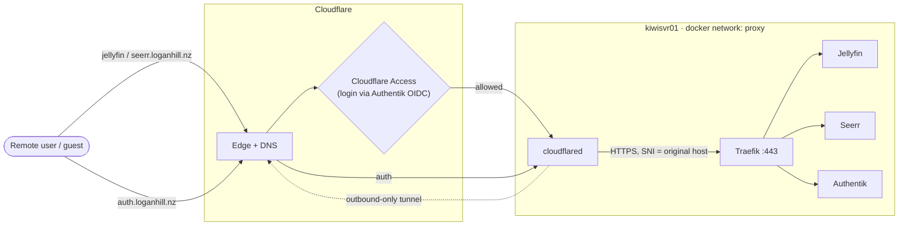
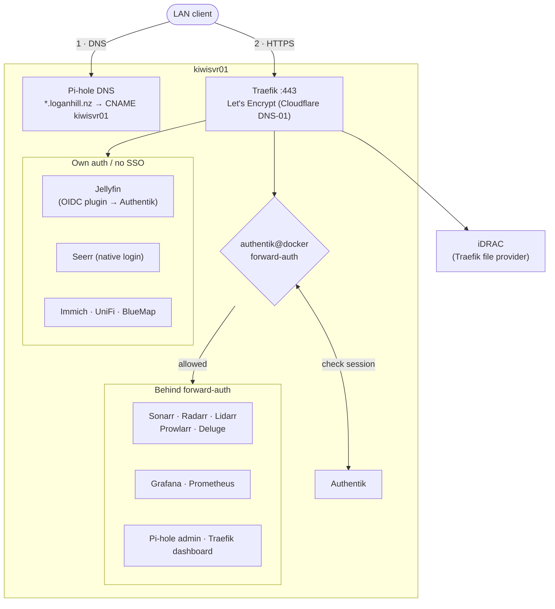
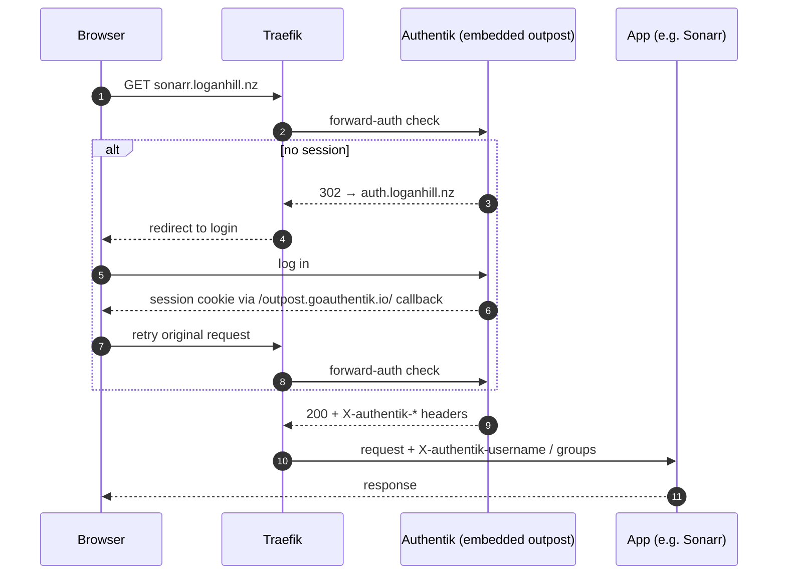
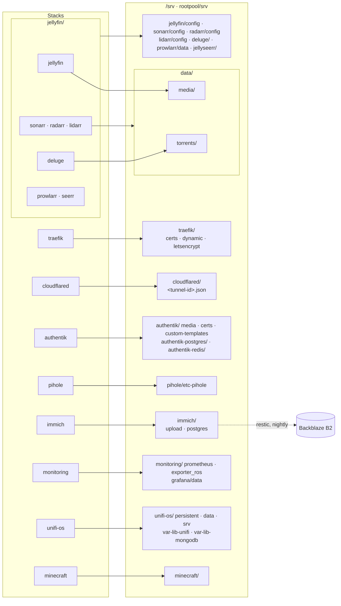

## docker-home

Docker Compose stacks for `kiwisvr01`, my homelab server. Each top-level directory is an
independent stack (its own `docker-compose.yml`, `.env`, and any config it needs).

### Operating system

Debian 13 (trixie) with Docker Engine + Compose. The NVIDIA Container Toolkit is installed so
Jellyfin and Immich can use the GPU (transcoding, and Immich's machine learning).

### Storage

Root-on-ZFS (OpenZFS 2.3) across 4× 4TB SAS HDDs and 2× 800GB SAS SSDs:

```
rootpool   raidz2 · 4× 4TB HDD           /, /var, /home, /srv
├─ logs    SSD 2 · part1 · 16G           SLOG
└─ cache   SSD 1 (whole) + SSD 2 · part3  L2ARC, ~1.4T total
bootpool   raidz2 · same 4 HDDs          /boot
swap       SSD 2 · part2 · 16G           raw partition, not ZFS
```

- **SLOG:** sync writes (Postgres, Mongo, overlay2 copy-ups) hit the SSD instead of the
  raidz2 ZIL on spinning disks. It's a single, unmirrored device, so it's only a risk if it
  dies *and* the host crashes within the same few seconds.
- **Swap** is deliberately a plain partition. It used to be a zvol, and swapping to a zvol can
  deadlock under memory pressure (which was occurring).
- **`sync=disabled` on `rootpool/var/lib/docker`.** When overlay2 copies a file up from an image
  layer, it links a temp file into place. ZFS can't log that link in the ZIL, so it forces a full
  pool sync (a txg sync) instead, and the SLOG can't help. Every copied-up file cost ~0.5s on the
  raidz2 HDDs: UniFi OS Server's first boot took >10 min and saturated host I/O, and 100 files
  took 55s. With sync disabled, the same 100 files take 17ms. The risk is losing the last ~5s of
  writes under `/var/lib/docker` on a crash, which only holds rebuildable data (image layers,
  container layers, caches). Real data lives in `/srv`, which keeps `sync=standard` and the SLOG.
- **ARC** is capped at 32 GiB (`/etc/modprobe.d/zfs.conf`, baked into the initramfs) so it
  leaves headroom for containers. It defaults to nearly all RAM.

All persistent container data (bind mounts, databases, media) lives under `/srv`
(`rootpool/srv`), bind-mounted into the containers.

### Backups

Restic, run by a systemd unit + timer (`restic-backup.service` / `.timer`, daily at 03:00).
Backs up Immich to Backblaze B2 and sends a notification via ntfy after every run.

### Networking

- **Traefik** (`traefik/`) is the reverse proxy / TLS termination for everything, listening on
  `80`/`443` and issuing Let's Encrypt certs. Services opt in via `traefik.*` Docker labels.
- Almost every stack joins the external `proxy` Docker network (created out-of-band, not by any
  compose file here — `docker network create proxy --ipv6`) so Traefik can route to them.
- **cloudflared** (`cloudflared/`) runs a Cloudflare Tunnel for the handful of services exposed
  to the internet (currently `auth`, `jellyfin`, `seerr`), fronted by Cloudflare Access.
- **pihole** (`pihole/`) is internal DNS/adblock for the LAN.

### Auth

**Authentik** (`authentik/`, `auth.loganhill.nz`) is the SSO/identity provider. Most internal
apps are gated by Traefik's `authentik@docker` forward-auth middleware. Two exceptions, because
neither app understands forward-auth headers or works with it for native clients:
- **Jellyfin** does its own OIDC via the `JellyfinSecurity` plugin instead of forward-auth.
- **Seerr** has no SSO support at all and uses its native login.

Guest access to Jellyfin/Seerr is handled by Cloudflare Access, itself backed by Authentik OIDC.

### Traffic flow

#### External (via Cloudflare Tunnel)

Nothing is port-forwarded for web traffic. `cloudflared` dials *out* to Cloudflare and holds the
tunnel open; requests come back down it and are handed to Traefik over HTTPS, with the original
hostname as SNI so Traefik matches the same routers and certs LAN clients get.



#### Internal (LAN)

Pi-hole does split-horizon DNS: every `*.loganhill.nz` service name is a local CNAME to
`kiwisvr01`, so LAN clients go straight to Traefik and never leave the network. Certs are real
Let's Encrypt certs issued via Cloudflare DNS-01, so the same hostnames work inside and out.



A few things skip Traefik and are published directly on the host: Minecraft (`25565`), Deluge
peers (`6881`), Jellyfin discovery (`7359/udp`, `1900/udp`), UniFi device ports, and Authentik's
`9000`/`9443` as an admin fallback.

#### Forward-auth, step by step



Grafana goes one step further and trusts `X-authentik-username` for its own login
(`auth.proxy` in `monitoring/grafana/grafana.ini`), so it's single sign-on end to end.

### Stacks

| Directory | What it runs | URL |
|---|---|---|
| `traefik/` | Reverse proxy, TLS termination | `:80`/`:443`, dashboard on `:8082` |
| `cloudflared/` | Cloudflare Tunnel client | — |
| `authentik/` | Authentik server/worker + its own Postgres/Redis | `auth.loganhill.nz` |
| `pihole/` | DNS + adblock | `pihole.loganhill.nz` |
| `jellyfin/` | Jellyfin + Sonarr, Radarr, Lidarr, Prowlarr, Deluge, FlareSolverr, Seerr | `jellyfin.loganhill.nz`, `seerr.loganhill.nz` |
| `immich/` | Immich photo management | `immich.loganhill.nz` |
| `monitoring/` | Grafana, Prometheus, and exporters (pihole, Mikrotik, node, ZFS, iDRAC) | `grafana.loganhill.nz` |
| `unifi-os/` | UniFi OS Server (Network app) | `unifi.loganhill.nz` |
| `minecraft/` | Minecraft server (CurseForge modpack) + BlueMap | `mc.loganhill.nz` |
| `watchtower/` | Watches for image updates, monitor-only, emails on findings | — |
| `ntfy/` | Reserved for a future ntfy deployment; no compose file yet | — |

#### Storage mappings

Where each stack's bind mounts land under `/srv`. `/srv/data` is shared by the media stack so
downloads and the library sit on one filesystem (hardlinks/atomic moves instead of copies).
Not shown: `docker.sock` mounts, config files bind-mounted straight from this repo, host
`/proc`/`/sys`/`/` for the node exporter, and Immich's `model-cache` named volume.



### Secrets

Each stack that needs credentials keeps them in its own `.env` (gitignored); where one exists,
copy the sibling `.example.env` and fill it in. `.gitignore` also excludes a few config files
that carry live secrets outside of `.env` (e.g. `monitoring/idrac.yml`, `pihole/.env`).

### Updates

Watchtower checks for new images across all stacks but is deliberately monitor-only — it emails instead of auto-restarting containers, since blind auto-updates risk breaking
things like Postgres or Traefik.
